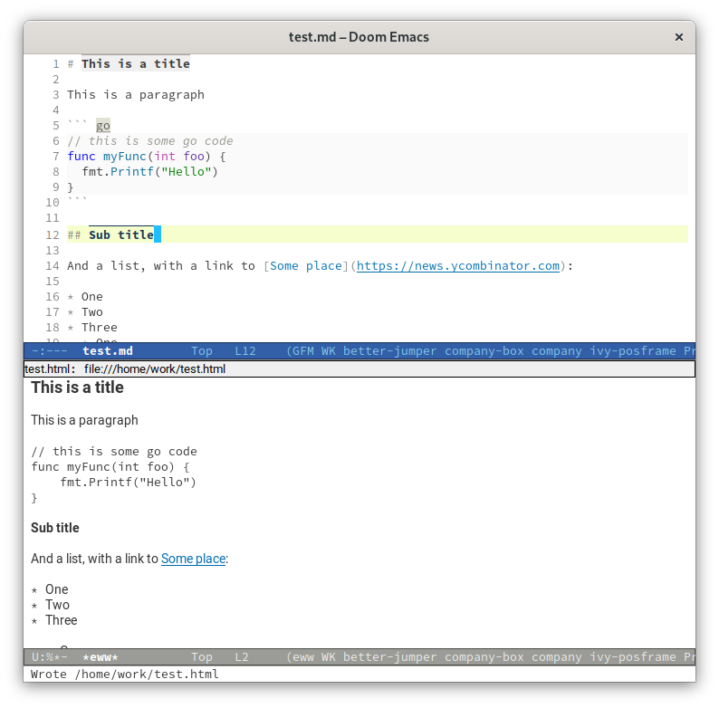
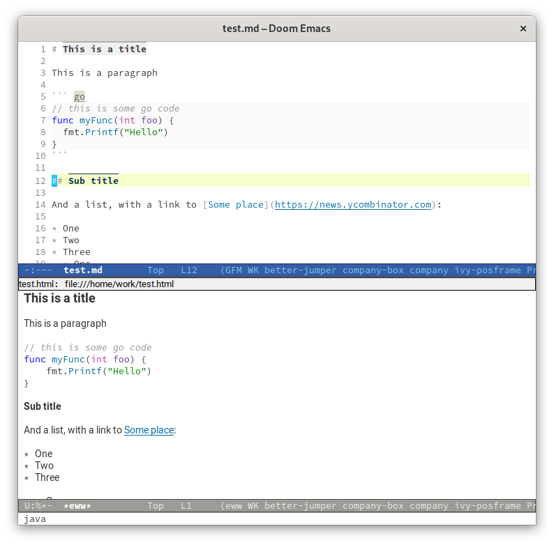

# shr-tag-code-highlight

## Introduction

`shr-tag-code-highlight` is a tag render extension (external render function) for the shr emacs HTML engine, which adds syntax highlighting to `code`` blocks.

The main target is to highlight `markdown-live-preview-mode` GFM code fences as converted by [pandoc](https://pandoc.org/) when viewed in [eww](https://www.gnu.org/software/emacs/manual/html_mono/eww.html).

It is based on the example provided Andreas Jansson's [language-detection.el](https://github.com/andreasjansson/language-detection.el) README and inspired by Chunyang Xu's [shr-tag-pre-highlight.el](https://github.com/xuchunyang/shr-tag-pre-highlight.el), with some differences:

* targets `code` blocks, not `pre`. pandoc generates `code` blocks wrapped in `pre`, so it does not make sense to override at the `pre` level.
* it uses `dom-texts` to grab the `code` block content and `shr-insert` to insert it to the highlighted temp buffer instead of `shr-generic`, which would set links ids markers incorrectly and crash the conversion.

### Example

| Before                              | After                              |
| ------------------------------------| ---------------------------------- |
|  |  |

## Installation

This package is not available in melpa yet.

If you use [quelpa](https://github.com/quelpa/quelpa), you can do:

``` emacs-lisp
(quelpa '(shr-tag-code-highlight :fetcher github :repo "dmacvicar/shr-tag-code-highlight.el")
  :after shr
  :config
  (add-to-list 'shr-external-rendering-functions
               '(code . shr-tag-code-highlight)))
```

For Doom Emacs:

```emacs-lisp
(package! shr-tag-code-highlight
  :recipe (:host github :repo "dmacvicar/shr-tag-code-highlight.el"))
```

```emacs-lisp
(use-package! shr-tag-code-highlight
  :after shr
  :config
  (add-to-list 'shr-external-rendering-functions
               '(code . shr-tag-code-highlight)))
```

# License

* Copyright (C) 2021 Duncan Mac-Vicar P.
* Copyright (C) 2016 Andreas Jansson

This program is free software; you can redistribute it and/or modify it under the terms of the GNU General Public License as published by the Free Software Foundation, either version 3 of the License, or (at your option) any later version.
